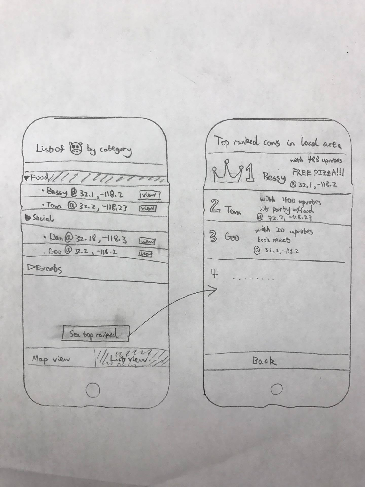
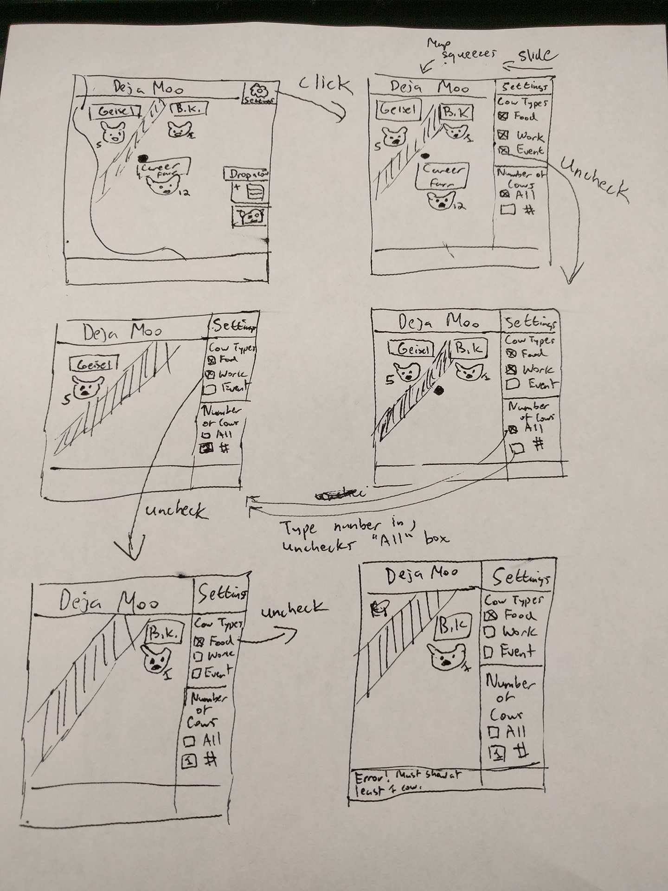
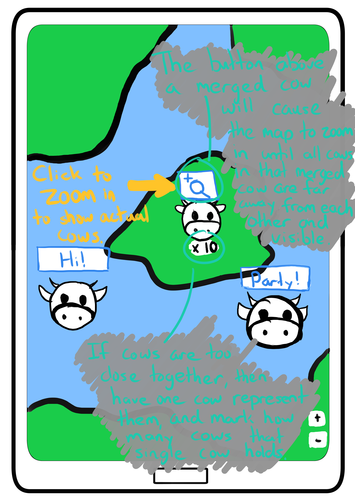
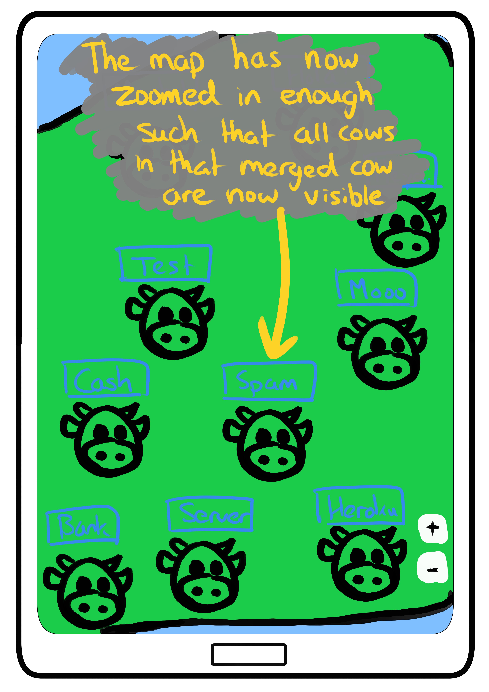
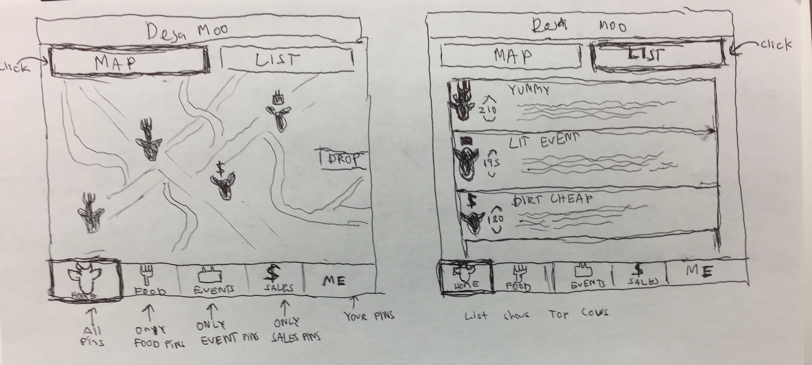

# Prototypes

## Siyu
This prototype shows the list view of all the cows dropped and a view where the cows are ranked and displayed.

## Ricky
This prototype features interactions with filtering different types of cows by type and number.  The settings bar slides from right to left when clicked on, squeezing the map so that it still shows all of the relevant cows.  Unchecking a cow type will make those types of cows disappear from the map.  When one enters a number for the cows, it will pick the x number of cows with the highest number of comments while still keeping in account the different types of cows.  In the prototype, Geisel is picked over B.K. because it has five comments compared to one.  However, once they uncheck the “work” type (Geisel), B.K. will reappear because there needs to at least be one cow showing.  Finally, unchecking the “food” type shows an error because there still needs to be at least one cow showing.  

## Phillip
This prototype displays the marker clustering effect, so that markers that are too close together don't make it difficult for
the user to navigate through.

## Arvin
The bottom tabs filter the types of cow pins you want. The ‘home’ tab means the map will show all types of cows, the food tab shows only food cow pins and so on. The top tabs switch the map to a list when you click ‘list’ and back to map view when clicked on ‘map.' When on list mode there is no map, and only the info windows of the cow pins are shown, in a list from the highest up voted cow pin to the lowest up voted cow pin.

